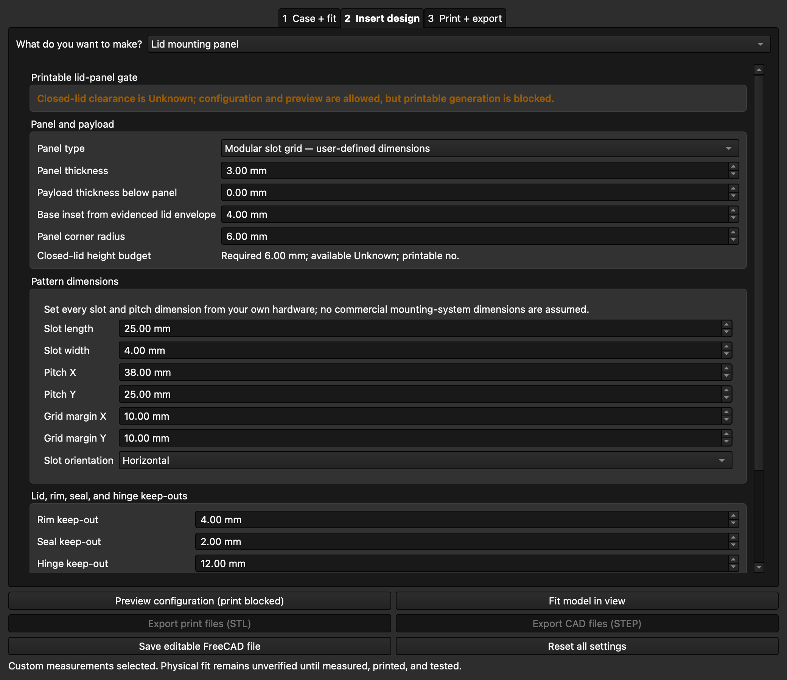

<!-- SPDX-License-Identifier: CC-BY-SA-4.0 -->

# Case Insert Generator

Case Insert Generator is a completely free, local-only FreeCAD workbench for
designing fitted inserts, removable bins, layered carriers, and printable
containment parts for measured storage cases.

It has no accounts, telemetry, cloud dependency, subscription, or paid tier.
The add-on runs in FreeCAD and stores the editable project specification inside
the FCStd document.

## Status

This fresh-history repository contains only the generic engine and original
synthetic examples. The bundled presets are convenient demonstration envelopes,
not commercial case dimensions and not physical-fit claims. Measure the inside
of a real case and print a tolerance coupon before printing a full insert.

Version 0.1.0 supports FreeCAD 1.1.3 through the 1.1.x series. Release
validation targets FreeCAD 1.1.3.

## Install locally

1. Download or clone this repository.
2. Place the `CaseInsertGenerator` folder in FreeCAD's user `Mod` directory.
3. Restart FreeCAD and choose **Case Insert Generator** from the workbench list.

The compatibility launcher remains available through **Macro → Macros…** by
running `CaseInsertGenerator.FCMacro` after the workbench is installed.

## Three-tab workflow

1. **Case + fit** — use your measurements, set fit clearances, and record
   whether closed-lid clearance is measured, CAD-derived, or unknown.
2. **Insert design** — add pockets, removable bins, existing-container bays,
   divider regions, layers, a containment method, or configure an inside-lid
   equipment panel. Locked objects do not move when trying the three
   deterministic layouts.
3. **Print + export** — select generated parts, optionally split them for the
   printer bed, then save FCStd or export STEP/STL.

The orange translucent plane always marks the case rim or seal height. A
separate closed-lid usable ceiling is shown only when the project contains
measured or CAD-derived evidence. Unknown lid space is never treated as usable.

## Inside-lid panels

Choose **Lid mounting panel** inside the existing **Insert design** tab. The
panel can be configured and saved while evidence is incomplete, but printable
STL/STEP generation is enabled only when both the lid-panel envelope and the
lowest closed-lid clearance are recorded as measured or CAD-derived and the
panel/payload height budget fits.

Three panel forms are available:

- a solid equipment panel;
- a parameterised modular slot grid; and
- a parameterised round-hole/perforated grid.

Slot length, width, X/Y pitch, X/Y margins, and orientation are explicit user
dimensions rather than assumptions about any commercial mounting system.
Panel thickness, payload thickness, rim/seal/hinge margins, local rectangular
lid-clearance keep-outs, perimeter mounting, printable quarter-turn retainers,
lift access, optional fastener holes, and keyed bed splitting are stored in the
same schema-v1 project JSON as the insert. Detailed mounting and split settings
remain under **Advanced mounting and split controls**.

STL and STEP export write each selected printable part separately. FCStd keeps
the complete editable project, evidence state, references, and every panel
setting. Geometry, export, and synthetic CAD evidence remain physical-fit
unverified until a real lid is measured, dry-closed, test printed, and loaded.

## SVG pockets

SVG import normalises document units and `viewBox` scaling, nested transforms,
compound holes, disconnected closed regions, fill rules, rotation, and pocket
clearance. Unsupported or ambiguous content is rejected with an actionable
message instead of producing a silently partial cut.

The implementation calls FreeCAD's installed LGPL `importSVG` module at runtime;
no upstream importer source is vendored. The pinned upstream reference is
recorded in [NOTICE](NOTICE).

## Example library

`examples/themed-packs/` is generated from twenty-three original, synthetic project
specifications. Each pack includes an editable FCStd assembly, an exploded FCStd
presentation model, assembly and exploded PNG renders, and the JSON source
specification. These are workflow examples only; their object sizes are not
measurements of real tools or cases.

`examples/lid-panel/` contains the original synthetic inside-lid panel in
schema-v1 JSON, assembled and exploded FCStd/PNG forms, plus a clean-profile
GUI capture of the Unknown-clearance print block. It is explicitly synthetic,
makes no compatibility claim, and remains physical-fit unverified.

## Third-party compatibility profiles

Compatibility profiles may be added only from independently measured or
otherwise redistributable dimensions. Each profile must state its evidence
source and physical-test status. A profile that has not been printed and tested
must say **designed for — physical fit unverified**; it must not claim
compatibility. Product names and trademarks remain the property of their
respective owners, and compatibility wording does not grant permission to copy
restricted drawings or geometry.

## Safety and limitations

- Generated geometry and exports do not prove physical fit, printer tolerance,
  lid closure, retention, loaded carrying, or material suitability.
- Verify wall thicknesses and clearances for the chosen printer and material.
- Use inert payloads for initial carry and rotation tests.
- Do not rely on an insert for medical, rescue, hazardous, or other critical
  storage without an appropriate independent validation process.

## Licence

Source code is licensed under LGPL-2.1-or-later. Original documentation and
visual assets are licensed under CC-BY-SA-4.0. See `LICENSES/` and [NOTICE](NOTICE).
