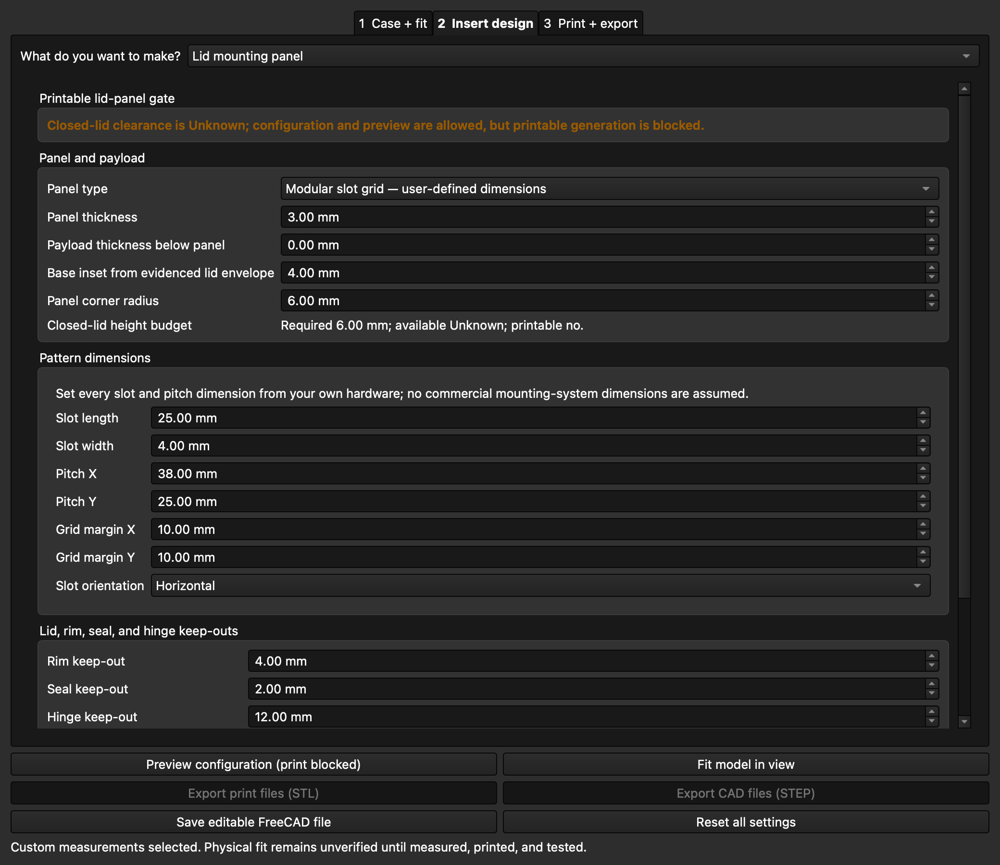

<!-- SPDX-License-Identifier: CC-BY-SA-4.0 -->

# Case Insert Generator

Case Insert Generator is a completely free, local-only FreeCAD workbench for
designing fitted inserts, removable bins, layered carriers, and printable
containment parts for measured storage cases.

It has no accounts, telemetry, cloud dependency, subscription, or paid tier.
The add-on runs in FreeCAD and stores the editable project specification inside
the FCStd document.



## Status

This fresh-history repository contains only the generic engine and original
synthetic examples. The bundled presets are convenient demonstration envelopes,
not commercial case dimensions and not physical-fit claims. Measure the inside
of a real case and print a tolerance coupon before printing a full insert.

Version 0.1.2 is a proposed patch release. Package metadata permits FreeCAD
1.1.3 through 1.1.x and Python 3.11 or newer. Current software validation was
performed on FreeCAD 1.1.4 on macOS arm64; this is the tested platform.
Current-candidate behavior on FreeCAD 1.1.3, Windows, and Linux is unverified.
Earlier v0.1.1 checks on FreeCAD 1.1.3 are historical evidence only.

## Install locally

1. Download the release ZIP and its SHA-256 checksum, or clone this repository.
   Verify the ZIP checksum before extracting it; the release archive has one
   `CaseInsertGenerator/` top-level folder.
2. Place the `CaseInsertGenerator` folder in FreeCAD's user `Mod` directory.
3. Restart FreeCAD and choose **Case Insert Generator** from the workbench list.

The compatibility launcher remains available through **Macro → Macros…** by
running `CaseInsertGenerator.FCMacro` after the workbench is installed.

To find the user data directory, open FreeCAD’s Python console and run
`print(App.getUserAppDataDir())`. Install into its `Mod` subfolder. Avoid adding
an extra nested `CaseInsertGenerator` folder when extracting the archive.

## Three-tab workflow

1. **Case + fit** — use your measurements, set fit clearances, and record
   whether closed-lid clearance is measured, CAD-derived, or unknown.
2. **Insert design** — add pockets, removable bins, existing-container bays,
   divider regions, layers, a containment method, or configure an inside-lid
   equipment panel. Locked objects do not move when trying the three
   deterministic layouts.
3. **Print + export** — select generated parts, optionally split them for the
   printer bed, then save FCStd or export STEP/STL.

After changing a design, click **Generate / update printable model** before
exporting. STL and STEP are available only when the generated geometry matches
the current settings. **Save editable FreeCAD file** updates the model and saves
the current settings; an incomplete lid configuration is saved as a preview.
The dialog stays attached to the document it was opened for, and generation can
be undone in FreeCAD. Generation enables document Undo when needed. Reopen the
dialog to work on another document.

The orange translucent plane always marks the case rim or seal height. A
separate closed-lid usable ceiling is shown only when the project contains
measured or CAD-derived evidence. Unknown lid space is never treated as usable.

## Inside-lid panels

Choose **Lid mounting panel** inside the existing **Insert design** tab. The
panel can be configured and saved while evidence is incomplete, but printable
STL/STEP generation is enabled only when both the lid-panel envelope and the
lowest closed-lid clearance are recorded as measured or CAD-derived and the
panel/payload height budget fits.

Three panel forms are available:

- a solid equipment panel;
- a parameterised modular slot grid; and
- a parameterised round-hole/perforated grid.

Slot length, width, X/Y pitch, X/Y margins, and orientation are explicit user
dimensions rather than assumptions about any commercial mounting system.
Panel thickness, payload thickness, rim/seal/hinge margins, local rectangular
lid-clearance keep-outs, perimeter mounting, printable quarter-turn retainers,
lift access, optional fastener holes, and keyed bed splitting are stored in the
same schema-v1 project JSON as the insert. Detailed mounting and split settings
remain under **Advanced mounting and split controls**.

STL and STEP export write each selected printable part separately. FCStd keeps
the complete editable project, evidence state, references, and every panel
setting. Geometry, export, and synthetic CAD evidence remain physical-fit
unverified until a real lid is measured, dry-closed, test printed, and loaded.

## SVG pockets

SVG import normalises document units and `viewBox` scaling, nested transforms,
compound holes, disconnected closed regions, fill rules, rotation, and pocket
clearance. Unsupported or ambiguous content is rejected with an actionable
message instead of producing a silently partial cut.

The implementation calls FreeCAD's installed LGPL `importSVG` module at runtime;
no upstream importer source is vendored. The pinned upstream reference is
recorded in [NOTICE](NOTICE).

SVG source files remain external references. Keep them available at their saved
paths to regenerate a project; moving or sharing an FCStd alone preserves its
existing geometry but does not include its SVG sources.

## Example library

`examples/themed-packs/` is generated from twenty-three original, synthetic project
specifications. Each pack includes an editable FCStd assembly, an exploded FCStd
presentation model, assembly and exploded PNG renders, and the JSON source
specification. These are workflow examples only; their object sizes are not
measurements of real tools or cases.

`examples/lid-panel/` contains the original synthetic inside-lid panel in
schema-v1 JSON, assembled and exploded FCStd/PNG forms, plus a clean-profile
GUI capture of the Unknown-clearance print block. It is explicitly synthetic,
makes no compatibility claim, and remains physical-fit unverified.

## Third-party compatibility profiles

Compatibility profiles may be added only from independently measured or
otherwise redistributable dimensions. Each profile must state its evidence
source and physical-test status. A profile that has not been printed and tested
must say **designed for — physical fit unverified**; it must not claim
compatibility. Product names and trademarks remain the property of their
respective owners, and compatibility wording does not grant permission to copy
restricted drawings or geometry.

## Export destination support

New STL/STEP files are published using filesystem hard links so an unconfirmed
file appearing during export cannot be overwritten. Exports fail safely when
the destination filesystem does not support hard links; FAT/exFAT destinations
are not supported by this publication method. Export to tested local storage
first, then copy the completed files using your file manager. Network shares
and removable filesystems have not been validated. Explicitly confirmed
overwrite paths may be replaced; avoid concurrent editing of those files.
FCStd saving uses FreeCAD’s save operation and is separate from the STL/STEP
staged-export recovery mechanism.

## Safety and limitations

- Generated geometry and exports do not prove physical fit, printer tolerance,
  lid closure, retention, loaded carrying, or material suitability.
- Verify wall thicknesses and clearances for the chosen printer and material.
- Use inert payloads for initial carry and rotation tests.
- Do not rely on an insert for medical, rescue, hazardous, or other critical
  storage without an appropriate independent validation process.

## Licence

Source code is licensed under LGPL-2.1-or-later. Original documentation and
visual assets are licensed under CC-BY-SA-4.0. See `LICENSES/` and [NOTICE](NOTICE).

## Development checks

Run the standalone tests and release-tree checks from the repository folder:

```sh
python -m unittest discover -s tests -v
python scripts/release_audit.py
reuse lint
```

With this checkout installed as the workbench, run
`RunRegressionChecks.FCMacro` from **Macro → Macros…** in the tested
FreeCAD 1.1.4 environment. It runs
the CAD integration, input-validation, recovery, and GUI state suites and writes
`artifacts/regressions/results.json` plus GUI screenshots. It leaves FreeCAD
open and uses temporary test documents. Each run keeps its own report and
screenshots in a dated subfolder. Run the separate `tests/gui_smoke.py`
script in a fresh FreeCAD profile when verifying installation and lazy startup.
On 7 October 2026 current-main validation passed 162 standalone tests and 63
native CAD/GUI checks (23 integration, 5 validation, 14 recovery, 21 GUI state),
including STEP/STL/FCStd export and reopen. The extracted candidate package
must pass these checks before publication. Physical fit remains untested.

Python callers of `engine.export_stl()` and `engine.export_step()` must pass
`overwrite=True` to replace existing files. `engine.export_paths()` returns the
actual destination list, including numbered part filenames. The GUI displays
those collisions before asking to replace them. Only the confirmed paths (or
those present at API entry with `overwrite=True`) may be replaced. New outputs
are installed atomically without replacement using same-filesystem hard links;
filesystems without hard-link support fail without an unsafe overwrite fallback.
Rollback checks ownership before removing newly installed outputs. If another
writer races with cleanup and its file cannot be restored without a collision,
the export reports where its recovery copy was retained.

The GUI recomputes `case.layout_inset` from the current contour and layer hardware,
while preserving a saved border above the original geometry's minimum. It records
that authored minimum as optional schema-v1 `case.layout_inset_min` so it survives
save/reopen even when geometry temporarily requires a larger inset. API callers
can set this nonnegative minimum explicitly, including when it equals the
geometry-derived value. Without that record, a legacy inset equal to the original
geometry requirement is treated as derived. To reduce an explicit border through
the API, update both inset fields.

Bundled examples are saved, audited snapshots. Manifest source hashes record the
inputs used for their historical generation; they need not match later source
edits. Tests still verify the exact hashes of every saved artifact and reject
altered examples. To refresh the examples for new generator inputs, commit the
source changes, regenerate with
`scripts/run_themed_examples_gui.py` and `scripts/run_lid_panel_example_gui.py`
in a dedicated FreeCAD GUI process, and rerun the checks before committing the
refreshed examples. These two renderer scripts exit their FreeCAD process when
finished. Keep physical-fit claims separate from these software checks.
